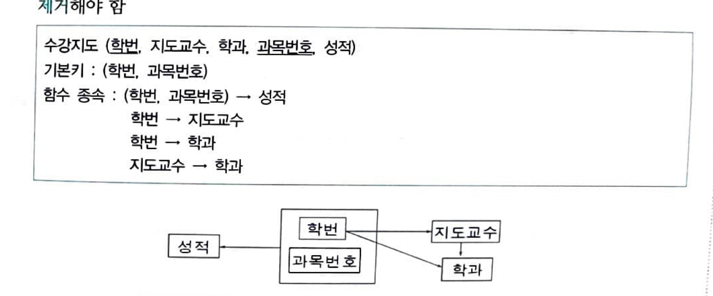
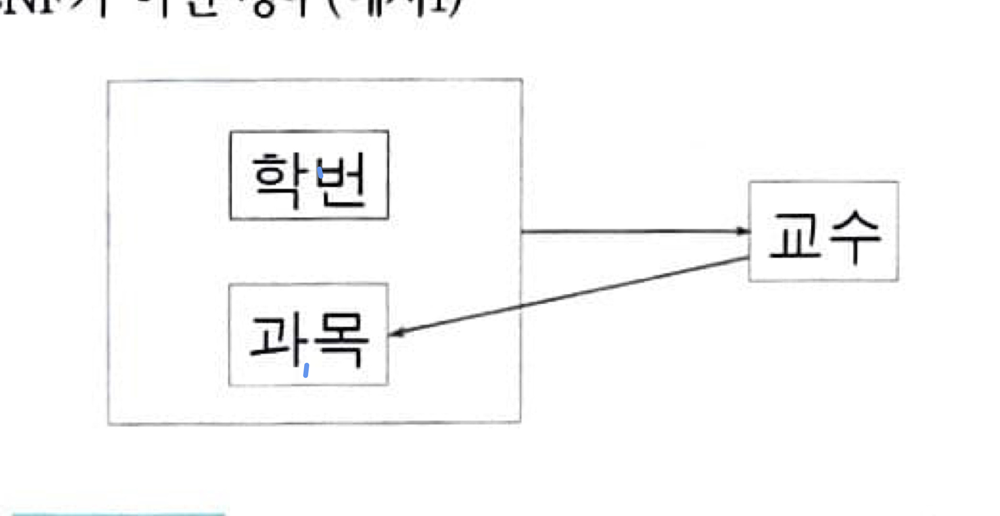
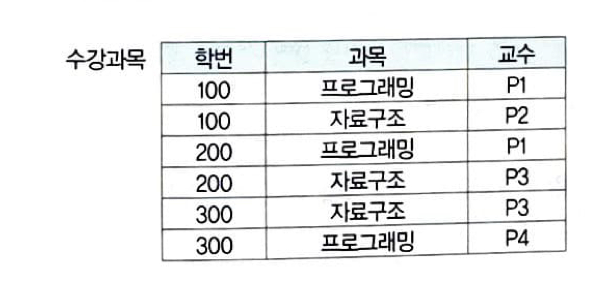

7주차 ~

## 정규화(Nomalization)
하나의 종속성이 하나의 릴레이션으로 표현되도록 분해하는 과정
데이터의 중복성을 최소화하여 중복에 따른 변경 이상(Anomaly) 현상을 제거
논리설계 단계에서 수행하며, 물리적 구조에 영향을 주지 않음

### 제1 정규형
원자값이 아닌 도메인을 분해

### 제2 정규형
부분 함수 종속 제거하기 전 (1NF만 완료된 상태)

그림에서 학번 + 과목번호 = (학번, 과목번호) 묶음이 성적을 결정하는 기본키이다.
근데 여기서 기본키의 부분인 학번이 지도교수와 학과를 결정짓고 있다. 이것이 부분 함수 종속인데 이걸 제거해야지 2NF가 만족된다

부분 함수 종속을 제거한 후

그래서 다음 그림과 같이 지도 릴레이션과 수강 릴레이션으로 분리함. 부분함수 종속을 제거하여 완전함수종속만 남도록 하였음.

### 제3 정규형
이행적 함수 종속 제거
위의 그림의 2NF에서 학번 -> 지도교수 -> 학과 관계가 나타나는데, 이는 A->B, B->C이면 B->C가 성립하는 이행적 함수종속이다. 이는 이상 현상의 원인이 된다.
이를 제거하기 위해, 학번 -> 지도교수, 지도교수 -> 학과로 분리한다.

### BCNF

Relation R의 모든 결정자가 후보키로 지정되어야 함. 결정자가 후보키가 아닌 함수종속을 제거해야 함.

그림을 보면, 기본키가 (학번, 과목) 이다. 여기서 결정자는 학번과 교수이다. (결정자: X->Y에서 X)

그런데 결정자 중 하나인 교수가 (학번,과목) 기본키의 후보키가 아니다. 그러므로 이러한 관계를 분해한다.

### 제4 정규형
함수종속이 아닌 다치종속 제거

### 제5정규형
후보키를 통하지 않은 조인종속 제거

## 이상(Anomaly)

삽입 이상
원하지 않는 정보를 강제 삽입해야 하는 경우
삭제 이상
유지되어야 하는 정보까지 연쇄 삭제되는 경우
갱신 이상
중복된 튜플 중에서 일부 Attribute만 갱신되는 경우

위의 BCNF에서의 예시를 보면 
릴레이션은 다음과 같다. 기본키는 (학번,과목)이다.

여기서 BCNF가 만족되지 못하고 있는 경우,
삽입 이상은, 만약 교수 P5가 자료구조를 담당하게 되었다는 사실만 추가하고 싶을 때, 학생의 학번도 추가로 입력하지 않고는 삽입 불가능
삭제 이상은, 학번이 100인 학생이 자료구조 과목을 취소하여 튜플이 삭제되면 이때 교수 P2가 자료구조 과목을 담당하고 있다는 정보마저 삭제됨
갱신 이상은, 교수 P1의 담당과목이 프로그래밍에서 자료구조로 변경된다면 P1이 나타난 모든 튜플에 대해 갱신이 있어야함.

위의 예는 BCNF지만 이러한 변경이상의 원인은 attribute 교수가 결정자이지만 후보키로 취급하고 있지 않기 때문.

## 트랜잭션(Transaction)

DB의 상태를 하나의 일관된 상태에서 또 다른 일관된 상태로 변환시키는 논리적인 연산의 집합
병행 제어 및 회복 작업의 논리적 단위

Atomicity
트랜잭션 내의 모든 연산은 한꺼번에 완료되어야 하며, 그렇지 못한 경우는 한꺼번에 취소되어야 한다. All or nothing.
Consistency
트랜잭션이 성공적으로 완료되면 일관성 있는 데이터베이스 상태로 변환된다.
트랜잭션의 실행 결과는 데이터베이스 상태에 모순되지 않는다.
Isolation
트랜잭션 실행 중에 있는 연산의 중간 결과는 다른 트랜잭션이 접근할 수 없다.
Durability
트랜잭션이 일단 그 실행을 성공적으로 완료하면 그 결과를 영구 기억장치에 저장해야 한다.

## 트랜잭션 격리 수준(Transaction Isolation Level)

SERIALIZABLE

REPEATABLE READ

READ UNCOMITED

READ COMITTED

